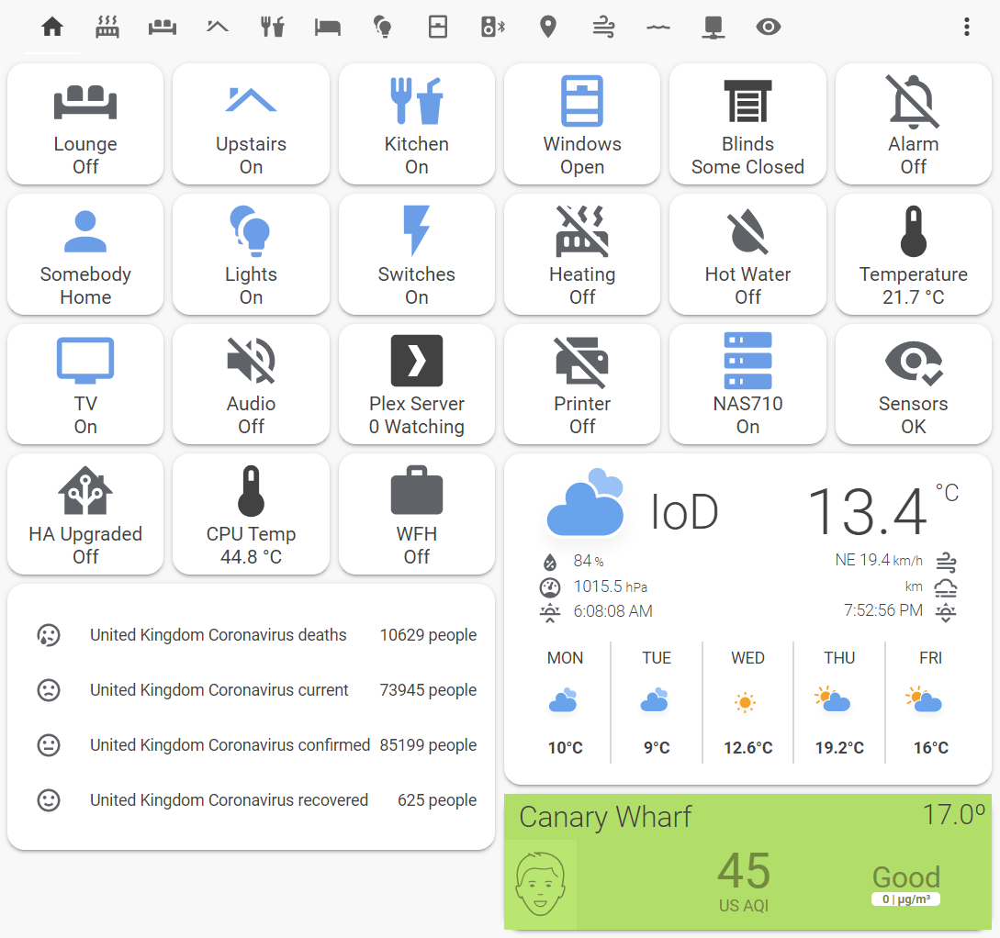
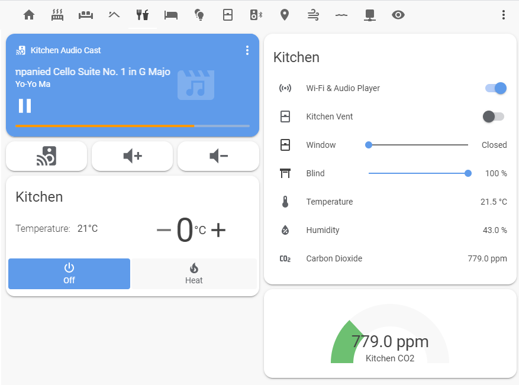
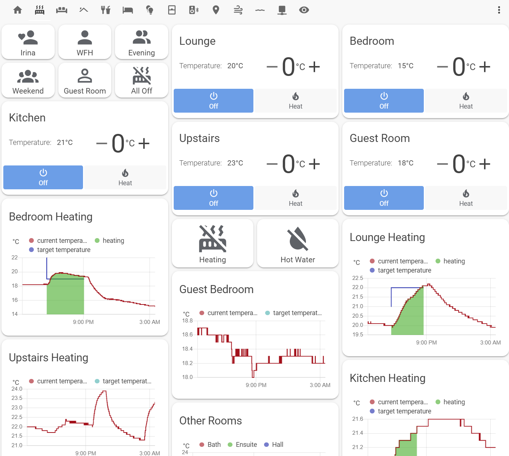

# Lovelace UI Screenshots

Although my Lovelace UI may not be the most scintillating, it is very functional.  My key goal was to provide a home page that gave immediate visual feedback of the state of the apartment and highlight essential points of action.  Users can then use this as a jumping off point to other screens. 

## Home Page Dashboard
As mentioned, I wanted the home page of HA to reflect the current status of everything in the apartment.  Each icon either represents a room in the apartment, a collection of similar components or an essential device.  Clicking the icon navigates the user to the relevant view so they can see the detail and/or interact with the device.  

For example, the Kitchen icon has a status of **On** which means some device is currently switched on in the kitchen, be it that audio is casting, the window is open, or the blind is shut.  Clicking the Kitchen icon navigates the user to the Kitchen *view*  shown below. 

  

 ## Kitchen View
This is a typical room view, which shows all the devices in that specific room.  Using this view, I can change the target temperature for the heating of this specific room, pause playback of the music using the media control, interact with the amplifier using the Logitech Harmony Hub remote control, or open close the blinds and windows.  Automations for the kitchen include opening the window if the CO2 level gets above 1250ppm.

 

## Heating View
This screen focuses on the central heating and hot water control.  The top six icons are shortcuts to scripts that turn on specific combinations of radiators.  For example, **WFH** (working from home) icon switches on only the radiators in the study.  The **All Off** icon turns the central heating off.

The various history graphs show how effective heating is in each room.  The blue line is the selected target temperature and the green area indicates when the radiator in that room was switched on.  As can be seen from the graphs, the upstairs room gets the benefit of  heating the lounge as there is no physical barrier between the two areas.

 