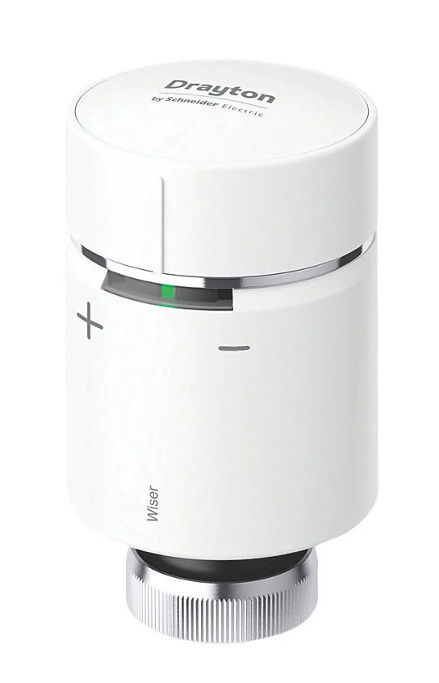
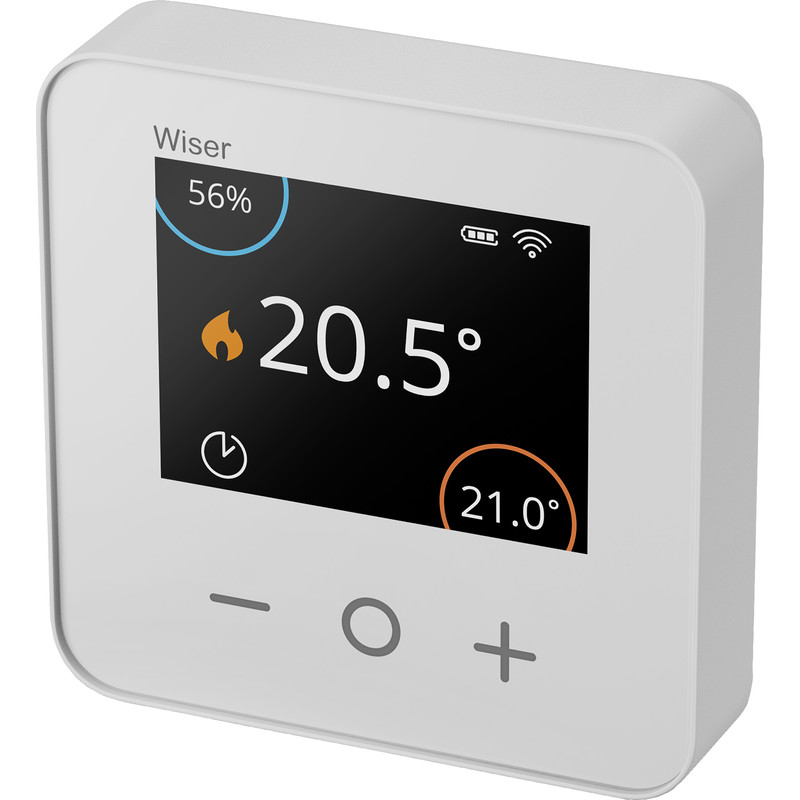
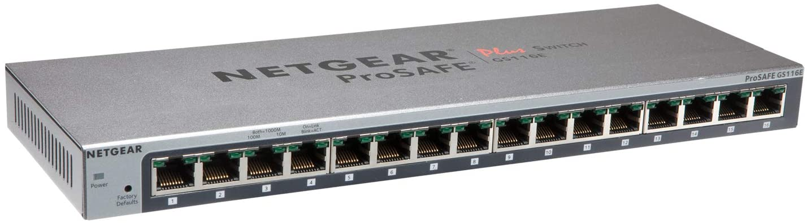
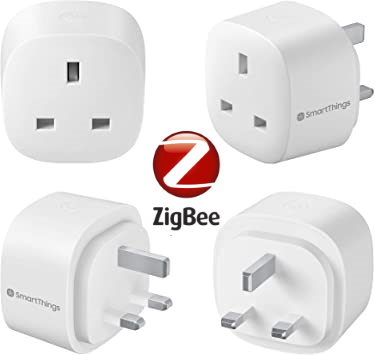

# Dr John's Home Assistant Configuration

  
  <href="https://github.com/hassio-addons/addon-tasmoadmin">
  
  <href="https://github.com/hassio-addons/addon-appdaemon4">
  <href="https://github.com/hassio-addons/addon-tasmoadmin">

## Key Components

| Velux Windows | Velux Blinds | Active CO2 Sensor | Velux Active Gateway |   
| --- | --- | --- | --- |
|  |  |   | 

| Risco Security Alarm |
| --- |
|   |

## Climate Control
| Drayton Wiser Multiroom Kit 2 | Drayton Wiser TRVs | Drayton Wiser Roomstat |
| --- | --- | --- | 
|  |  |  | 

## Network Infrastructure
| Netgear ReadyNAS | Netgear Wireless AP | Netgear 16-Port Switch | Netgear 5-port Switch | Virgin Hub 3.0 | 
| --- | --- | --- | --- | --- |
|  |   |  |  |   |

## Lighting
| LED Strip Light Controllers | SmartThings Smart Plugs | Xiaomi Aqara Wall Switch | Xiaomi Smart Button |
| --- | --- | --- | --- |
|  |  |  |  |

## Voice Interaction
| Google Assistant | Google Nest Mini | Google Pixel |
| --- | --- | --- |
|  |  |   | 

## Home Assistant Hardware

| [Raspberry Pi 4 Model B 4GB](https://thepihut.com/products/raspberry-pi-4-model-b) | [Raspberry Pi 4 Enclosure](https://www.ebay.co.uk/itm/Raspberry-Pi-4-Pi4-Case-Cooling-Kit-inc-Fan-Heatsink-35-C-lower-temps/) | [SanDisk Extreme 64GB MicroSD]() | [Raspberry Pi 4 Power Supply](https://thepihut.com/products/raspberry-pi-psu-uk) |
| --- | --- | --- | --- |
|  |  |  |  |

## Home Assistant Software

