<table width="100%" border=0>
  <tr>
    <td>
    
      Dr John's Home Assistant Configuration
    </td>
    <td style="text-align:right;">
      
    </td>
  </tr>
</table>

Home Assistant has made numerous improvements to the way we live, making our lives easier in many ways.  This repo is dedicated to the hard work of those who have put their heart and sole into this product and this community.

Below I list the components, how they are used and why.  However, all that is a little cold if you don't know the benefits Home Assistant can bring.  So, in each section I try to highlight the key problems, the solutions and key benefits.

# Climate Control
| Velux Windows | Velux Blinds | Velux Active CO2 Sensor | Velux Active Gateway |   
| --- | --- | --- | --- |
|  |  | 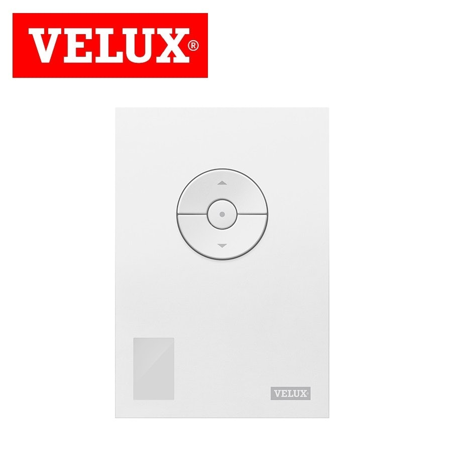  | 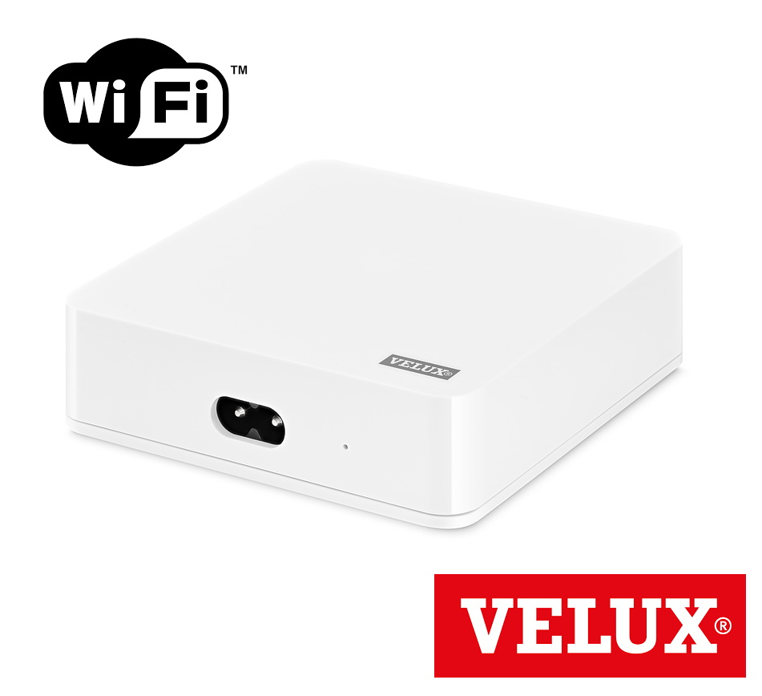 |

When I extended the apartment some years ago, I had five [Velux Integra](https://www.velux.co.uk/products/roof-windows/integra) roof windows installed, each with their own blackout blind.  Although Velux provide a remote control device, they use the [IO-Homecontrol](http://www.io-homecontrol.com/) protocol for which there is no direct interface.  After doing much research, I found an integration root: [Velux Active](https://www.velux.co.uk/products/smart-home/velux-active) works with [Apple HomeKit](https://www.home-assistant.io/integrations/homekit/) which is a [zeroconf Home Assistant](https://www.home-assistant.io/integrations/zeroconf/) integration!  Now all five windows and five blinds can be controlled by Home Assistant along with the  [Velux Active](https://www.velux.co.uk/products/smart-home/velux-active) temperature / CO2 sensors.

Note that [Velux Active](https://www.velux.co.uk/products/smart-home/velux-active) is touted as indoor climate control system which will keep your home fresh by period ventilation.  This marketing speak equates to the system opening and closing your windows at random throughout the day, regardless of the outdoor temperature.  Very unwelcome in the winter!  The first thing I did was switch off all automations in the Velux app and implemented proper automations in Home Assistant.

One benefit of [Velux Active](https://www.velux.co.uk/products/smart-home/velux-active) is that it comes with a CO2 sensor which also operates as a remote control for the windows in the same room.  I now have an automation which opens the kitchen window when the CO2 level reaches over 1250ppm or if either gets to hot, both of which often occur during cooking.

| Drayton Wiser Multiroom Kit 2 | Drayton Wiser TRVs | Drayton Wiser Roomstat | Central Heating & Hot Water System (2-Channel) |
| --- | --- | --- | --- | 
| 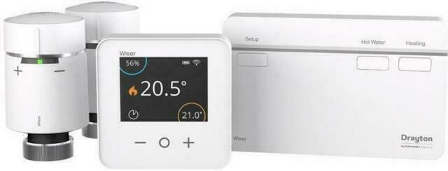 | 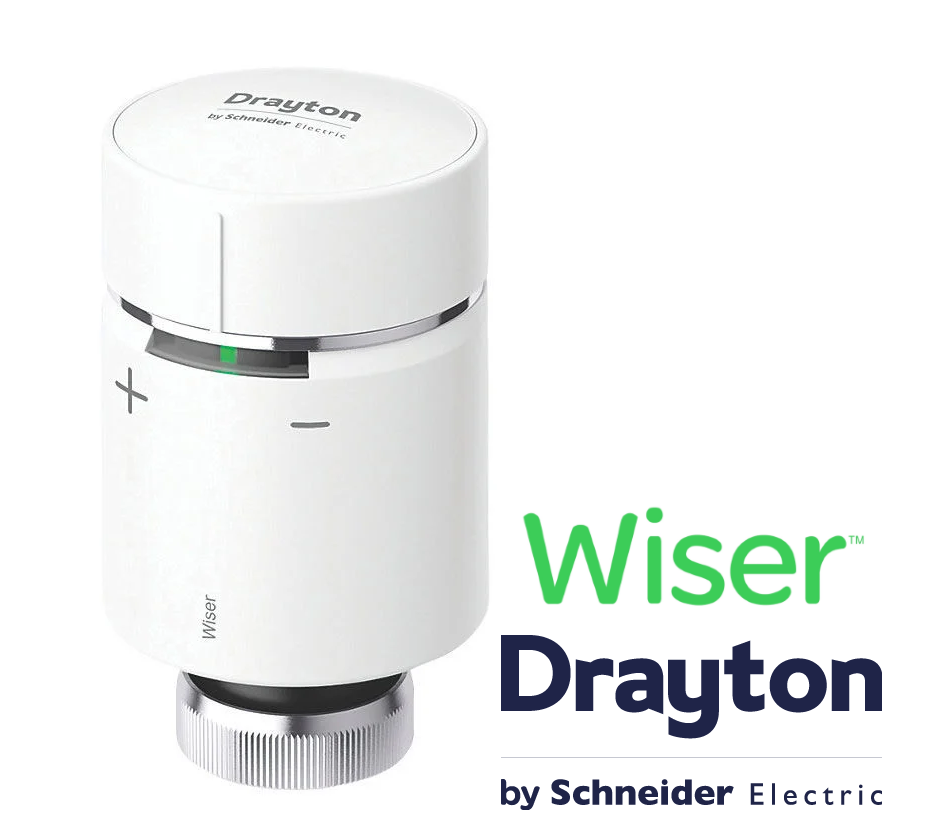 | 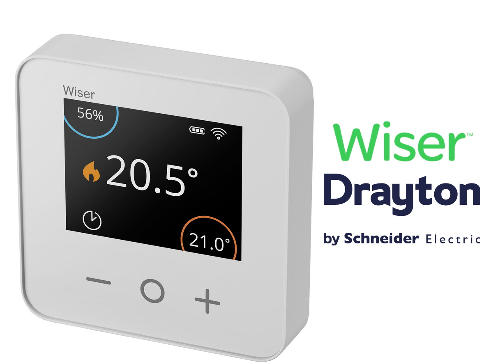 | 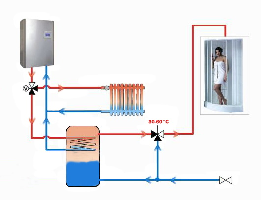 |

Like most homes the heating was either all or nothing. That is, once the boiler is on, then all the radiators get hot regardless.  Obviously thermostatic radiator valves can reduce the temperature in certain rooms, but that does not cater for the following senarios: 
<ul>
<li>When working from home, I want to switch off all the radiators in the rest of the home.</li>
<li>When my partner is home alone, only the bedroom needs heating, so switch off all the radiators in the rest of the home</li>
<li>When the family is about, I want the whole home heated</li>
</ul>

I found that I was constantly walking around the flat turning the radiator valves on and off manually.  Clearly I neede remote controlled thermostatic values on each radiator which would allow me to set the temperature of each room individually.

I posted my requirements on the [community forum](https://community.home-assistant.io/t/167409/) so others could make suggestions.  Then I fortunately came across the excellent Drayton Wiser Heat Hub integration for Home Assistant by @Angelo_Santagata and team is available on HACS as the *Wiser Heating Component for Home Assistant*

I now have room by room heating control which adapts to where we are and what we are doing.

Every country has their own way of describing central heating systems and how they operate.  In the UK, we rarely have integrated heating and cooling systems (HAVC), whereas these are common place in other countries with more extreme climates.  For clarity, I include the final image above shows the pipework that underpins a typical British central heating & hot water system.  As there are two valves controlling two sets of pipework, this is call by plumbers a *2-channel system*.  

# Audio / Visual
Years ago, I was a serious Hi-Fi buff and this reflects in my choise of audio components found around the apartment.  Originally, I had a Logitech Squeezebox Touch in every room streaming music from a central Logitech Music Server (LMS).  Unfortunately, these units were discontinued by Logitech years ago and with the advent of high-quality streaming services such as [Tidal](https://tidal.com/), I was in dire need of a technology refresh. So I purchased a couple of [Google Chromecast Audio](https://www.google.com/chromecast/built-in/audio/) devices and was amazed to find just how good they were!  Firstly, they have a *full dynamic range* mode so that they are able to drive my stereo system to an acceptable level.  Also, to my surprise they have a *group* mode so that the same music can be streamed to several rooms (i.e. multiroom).  After a few months of running both systems in parallel I found I hardly used Logitech system anymore as streaming  [Tidal](https://tidal.com/) to [Chromecast Audio](https://www.google.com/chromecast/built-in/audio/) was so, so convenient.  So the Logitech units were sold and my use of Plex expanded to encompass my own music collection.  I always had a love/hate relationship with the Logitech Music Server (LMS), so I was very glad to see it go!
 
## Lounge AV
| EPOS M16i Speakers | Audiolab CDQ / Amp | Chromecast Audio | Logitech Harmony Hub | 
| --- | --- | --- | --- |
|  |  |  | 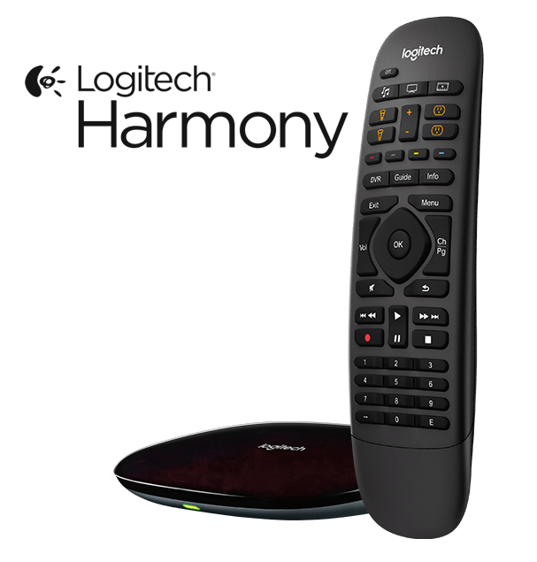 |  

| Samsung Smart TV | Live TV & Streaming Services | Humax Freesat PVR | Samsung Blu-Ray Player |
| --- | --- | --- | --- |
|  |  |  |   |  

My lounge AV is built around my aging stereo system.  Fortunately the Audiolab CDQ has multiple digital inputs which allow it to be my *AV receiver*.  Although the Audiolab units do have a IR remote control they only have a manual power button.  The Logitech Harmony Hub Companion was a godsend, but it only solved some of the problems.  Obviously it did not power on the Audiolab units, but worse did not change the TV input correctly when changing source.  This is particularly annoying as the Harmony Hub does know how to send a IR command to select a particular input on the TV, but does not allow you to select it in their app.

Home Assistant automations allowed me to solve all the outstanding issues with the Harmony Hub.  I set up automations for each state change event that needed an input change.  For example, when changing from watching a BluRay disk to watching the Freesat PVR needs a different HDMI port to be selected. An automation would detect the change and have the Harmony Hub send the correct IR sequence.  Some automations required a delay while the peripheral warmed up.  For example, the TV takes approx 10 seconds to switch on, so I had to delay the HDMI port change request until it was ready.  This I did by simply sending the same request multiple times, after a few second delay. 

The final problem of the manual switches on the Audophile equipment was solved by a Smart Plug.  I simply leave the Audophile equipment switched on and have the Smart Plug turn on the power when requested by a Harmong Hub state change.  

The result is that a collection of new and aging equipment works together flawlessly.

## Multiroom Audio
| Q Acoustic 2020i Speakers | Pro-Ject Stereo Box S2 | Google Chromecast Audio | Logitech Harmony Hub |
| --- | --- | --- | --- |
| 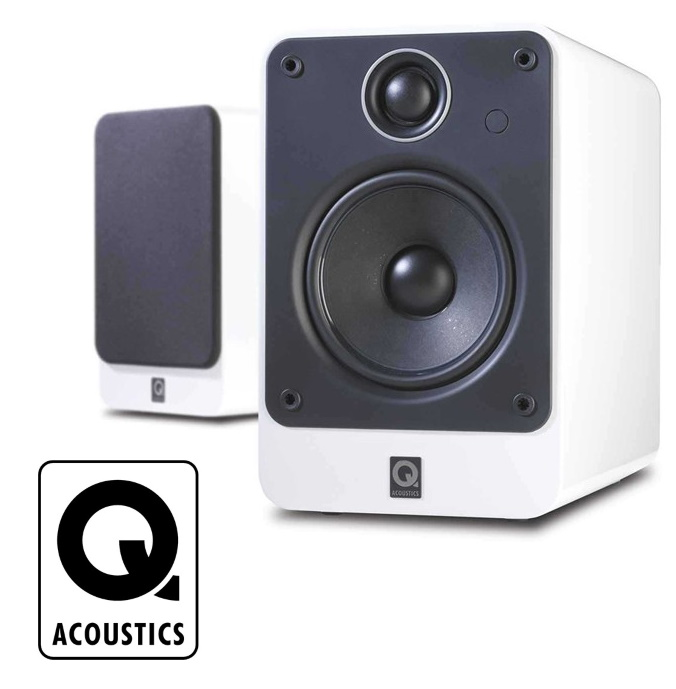 |  |  |  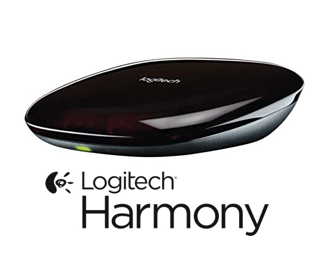 |  

In addition to the lounge, all other rooms have a set-up built around the dimunuative Pro-Ject Audio Stereo Box S2 amplifier, a pair of Q Acoustic 2020i speakers and a [Google Chromecast Audio](https://www.google.com/chromecast/built-in/audio/).  Each room has a Logitech Harmony Hub which allow me (via Home Assistant) to control the multiroom audio throughout the home.  So guests can stream their own music to the room they are in, or I can stream the same music to every room.  All very convenient!

The master bedroom has the above setup plus another [Samsung Smart TV](https://www.samsung.com/uk/tvs/smart-tv/highlights/) and [Google Chromecast](https://store.google.com/gb/product/chromecast) device for video streaming.  The guest room simply has a [LG TV](https://www.lg.com/uk/tvs) with a [Google Chromecast](https://store.google.com/gb/product/chromecast).

## Live TV and Streaming Services
Like most people, I have far too much choice when it comes to programming.  Beside the modest 300+ movies on my own [Plex media server](https://www.plex.tv/), I have access to several friends [Plex servers](https://www.plex.tv/) which amount to another 2,000 or so movies and TV series.  My [Humax Freesat PVR](https://uk.humaxdigital.com/product/hdr-1100s/) has hundreds of live TV channels, of which I only watch the BBC. Basically, there are not enough hours in my life to watch all that content!

[Tidal](https://tidal.com/) is my music streaming service of choice as it provides high quality audio content with great ease of use. Years ago, I used Spotify but they made the rash decision to stop supporting Logitech Media Server (which I had at the time), so I could no longer play music in multiple rooms.  At the time, [Tidal](https://tidal.com/) lacked some of the features of Spotify, but they have soon caught up.  I now have a family subscription, so all five family members can enjoy high quality streaming services. 

[Netflix](https://www.netflix.com/) is my video streaming service of choice.  [Amazon Prime Video](https://www.primevideo.com/) annoys me because every film I seem want to watch is an additional charge.  I would really like them to add a *Show included content only* option, but obviously that will never happen!

I only ever use the [HD HomeRun](https://www.silicondust.com/) to watch Live TV on my desktop PC when I am working from home and there is some specific political event going on.  I did try the integration with [Plex TV](https://www.plex.tv/en-gb/tv/), but I don't see the point as I have a perfectly good [Humax Freesat PVR](https://uk.humaxdigital.com/product/hdr-1100s/) which records a better quality picture and is far more convenient to use.

# Home Automation Components

## Home Assistant Hardware

| Raspberry Pi 4 Model B 4GB | Raspberry Pi 4 Enclosure | Conbee II Zigbee Gateway | SanDisk Extreme 64GB MicroSD | 
| --- | --- | --- | --- |
| 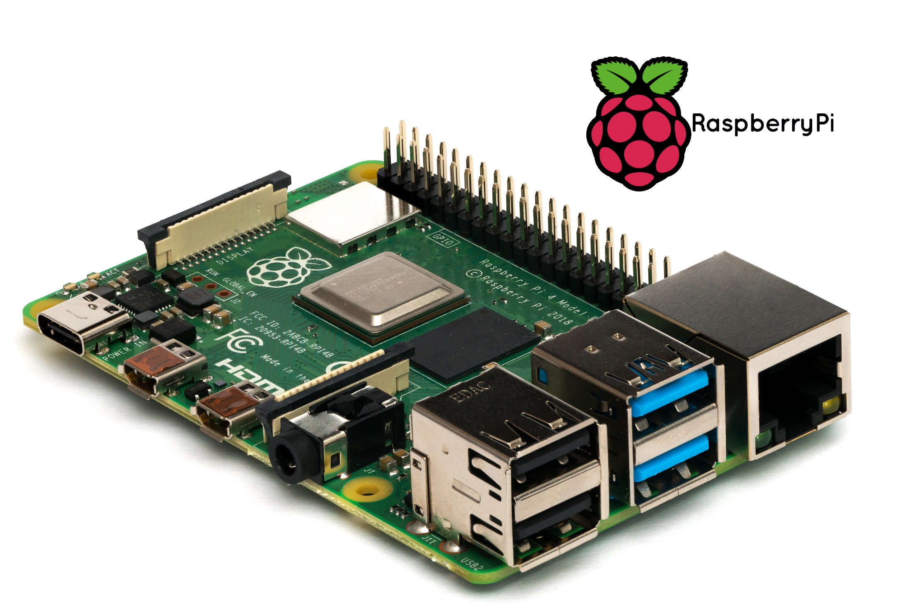 | 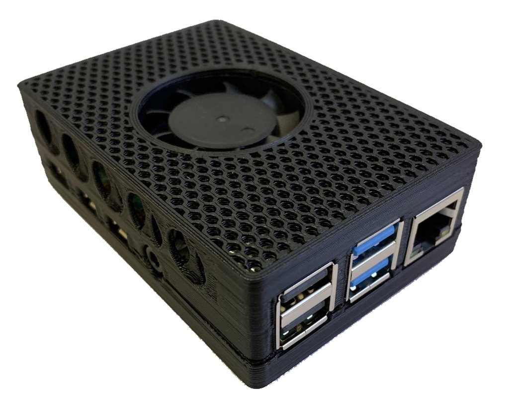 |  |  | 

[Conbee II](https://phoscon.de/en/conbee2)
deCONZ by dresden elektronik is a software that communicates with ConBee/RaspBee Zigbee gateways and exposes Zigbee devices that are connected to the gateway.
[Raspberry Pi 4 Enclosure](https://www.ebay.co.uk/itm/Raspberry-Pi-4-Pi4-Case-Cooling-Kit-inc-Fan-Heatsink-35-C-lower-temps/)

## Home Assistant Software

## Voice Interaction
| Google Nest Mini | Google Assistant | Google Pixel Phone |
| --- | --- | --- |
| 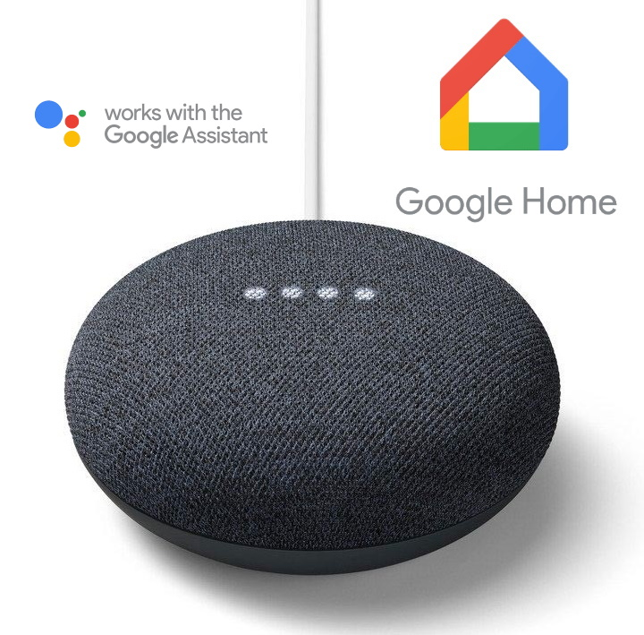 |  |  | 

Having had Android phones for many years, Google Assistant seemed the natural choice for voice interaction with Home Assistant.  Fortunately, I discovered Google provides various celebrity  John Legend

 My only bug bear is that Google Home does not support Tidal as a native music provider whereas they do support Spotify, Deezer and their own subscription services YouTube & Google music.  So I cannot 

## Lighting
| LED Strip Light Controllers | SmartThings Smart Plugs | Xiaomi Aqara Wall Switch | Xiaomi Smart Button |
| --- | --- | --- | --- |
|  | 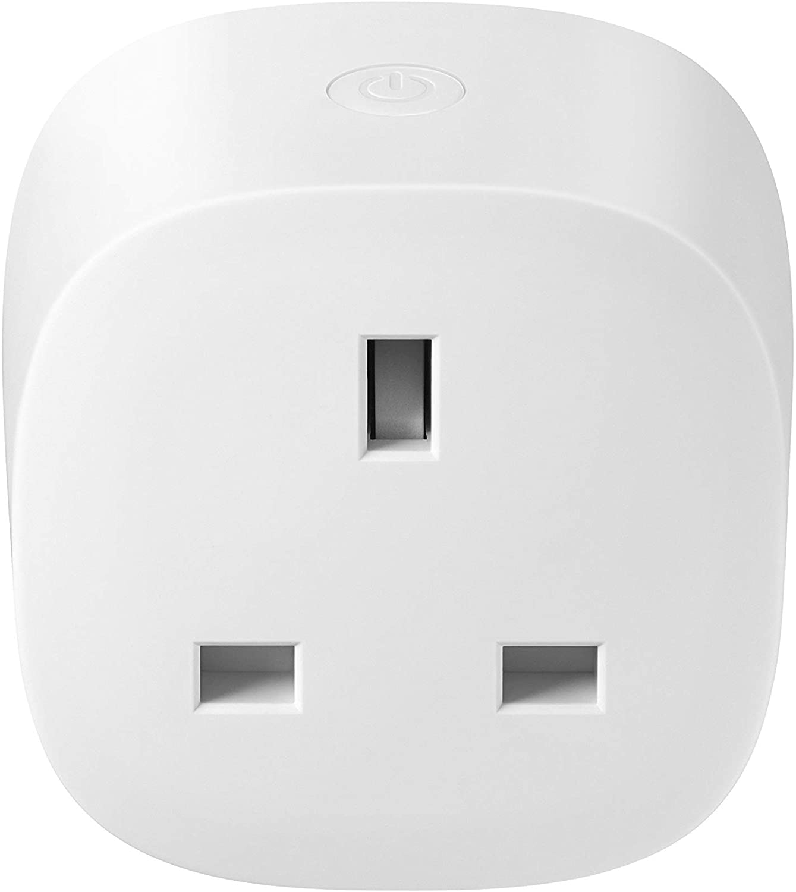 | 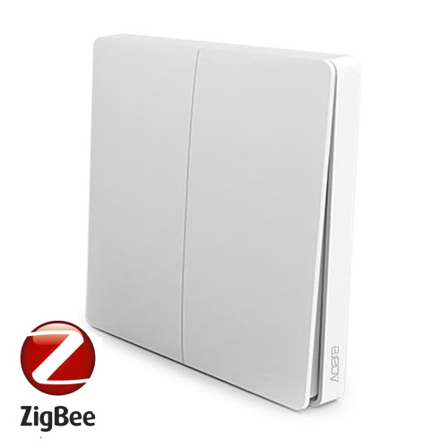 |  |

| Risco Security Alarm |
| --- |
| 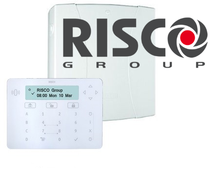  |

Backup routine

<table class="fpsb">
  <tr>
    <td class="fpsb-la">Feature:</th>
    <td class="fpsb-ra">Humidity controlled fans</th>
  </tr>
  <tr>
    <td class="fpsb-la">Problem:</th>
    <td class="fpsb-ra">The fan used go on and off with the light switch. This was particularly annoying as the fan is noisy, especially at night. Often we would disable the fan with the tri-pole switch, but this meant people had to proactively remember to flick on the switch before having a shower - which they never did! Also, after having a shower, the fan goes off with the light switch, thus leaving behind a steamy bathroom.</th>
  </tr>
  <tr>
    <td class="fpsb-la">Solution:</th>
    <td class="fpsb-ra">Now Home Assistant switches on the bathroom fan when the humidity goes over 75% and off again when it drops below this point. The result is that the fan only comes on when it is needed. No more, no less.
    </th>
  </tr>    
  <tr>
    <td class="fpsb-la">Benefit:</th>
    <td class="fpsb-benefit">No more noisy fans or steamy bathrooms!</th>
  </tr>      
</table>

## Network Infrastructure
| Netgear ReadyNAS | Netgear Wireless AP | Netgear Switches | Virgin Hub 3.0 | 
| --- | --- | --- | --- | 
| 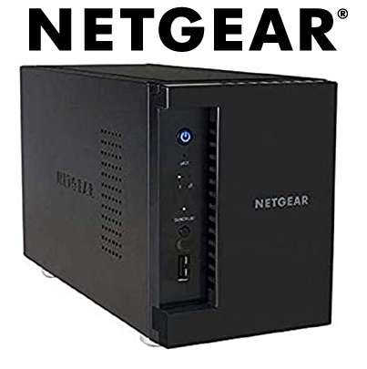 | 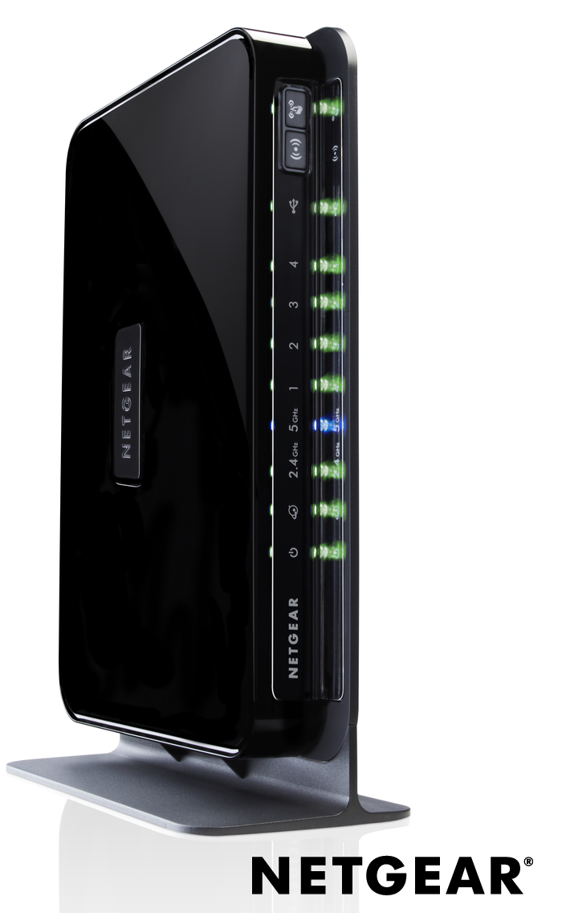  | 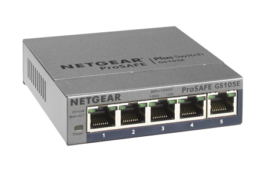 |   |

I had Cat6 cabling installed throughout the apartment when I had it renovated and extended.  The network cupboard nestles under the eaves of the building and contains a 16-port Netgear Ethernet switch, the Netgear ReadyNAS which runs [Plex media server](https://www.plex.tv/), the [Velux Active](https://www.velux.co.uk/products/smart-home/velux-active) gateway and the unused [HD HomeRun](https://www.silicondust.com/).  Fortunately, I had the foresight to have both standard telephone cable and three coaxial cables run into the network cupboard from the outside.  This proved very useful when I switched broadband providers as it gave me the option to use [Virgin Media](https://www.virginmedia.com/) cable modem service.  The Virgin Hub 3.0 is not the best, but it is provided free of charge and gave me the chance to repurpose my Netgear router as a wireless access point for the kitchen.

## Acknowledgements
This repo is inspired by the excellent work of others listed on the [Awesome Home Assistant](https://www.awesome-ha.com/) page, especially [James McCarthy of Kingia Castle](https://github.com/JamesMcCarthy79/Home-Assistant-Config).

## Trademark Legal Notice
This repo is not created, developed, affiliated, supported, maintained or endorsed by Home Assistant.

All product names, logos, brands, trademarks and registered trademarks are property of their respective owners.  All company, product, and service names used in this repo are for identification purposes only.

Use of these names, logos, trademarks, and brands does not imply endorsement.