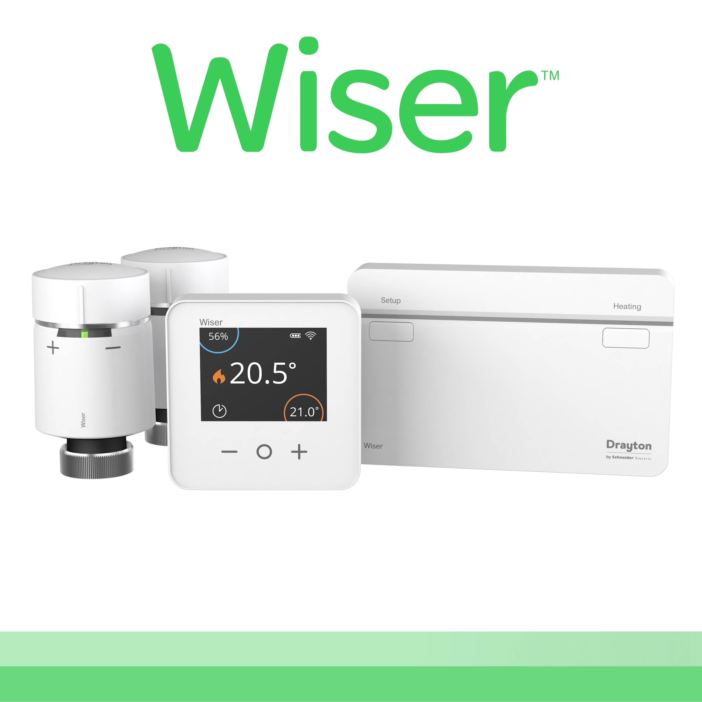
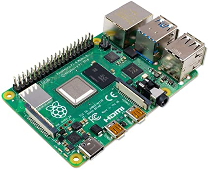
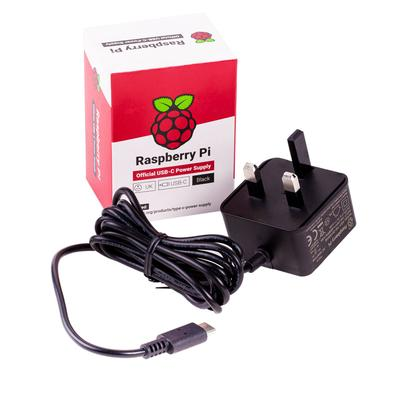

# Dr John's Home Assistant Configuration

  
  <href="https://github.com/hassio-addons/addon-tasmoadmin">
  
  <href="https://github.com/hassio-addons/addon-appdaemon4">
  <href="https://github.com/hassio-addons/addon-tasmoadmin">

## Key Components

| Velux | Risco | Wiser |
| --- | --- | --- |
|  |  |    |

## Home Assistant Hardware

| [Raspberry Pi 4 Model B 4GB](https://thepihut.com/products/raspberry-pi-4-model-b) | [Raspberry Pi 4 Enclosure](https://www.ebay.co.uk/itm/Raspberry-Pi-4-Pi4-Case-Cooling-Kit-inc-Fan-Heatsink-35-C-lower-temps/) | [SanDisk Extreme 64GB MicroSD]() | [Raspberry Pi 4 Power Supply](https://thepihut.com/products/raspberry-pi-psu-uk) |
| --- | --- | --- | --- |
|  |  |  |  |

## Home Assistant Software

