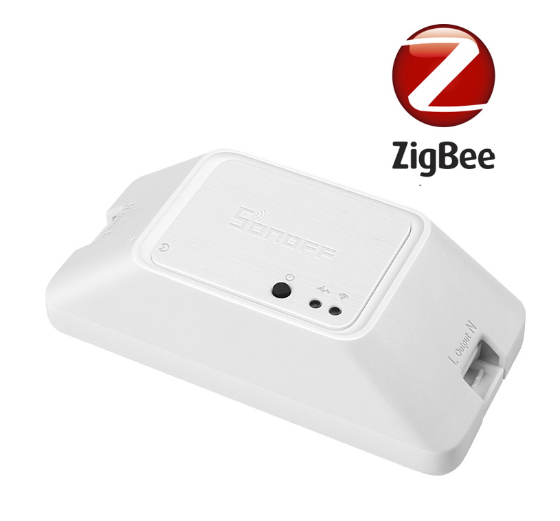
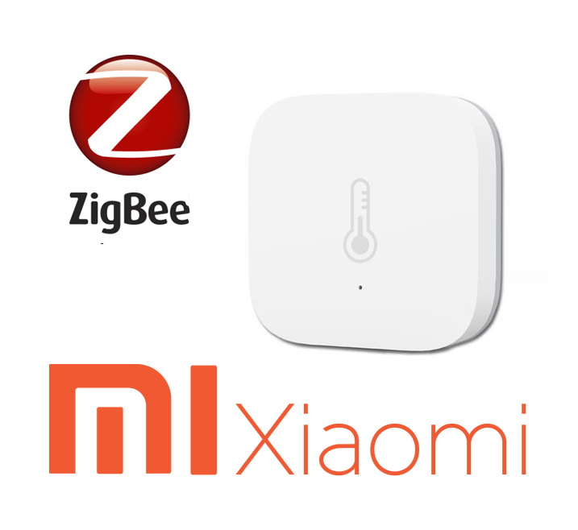
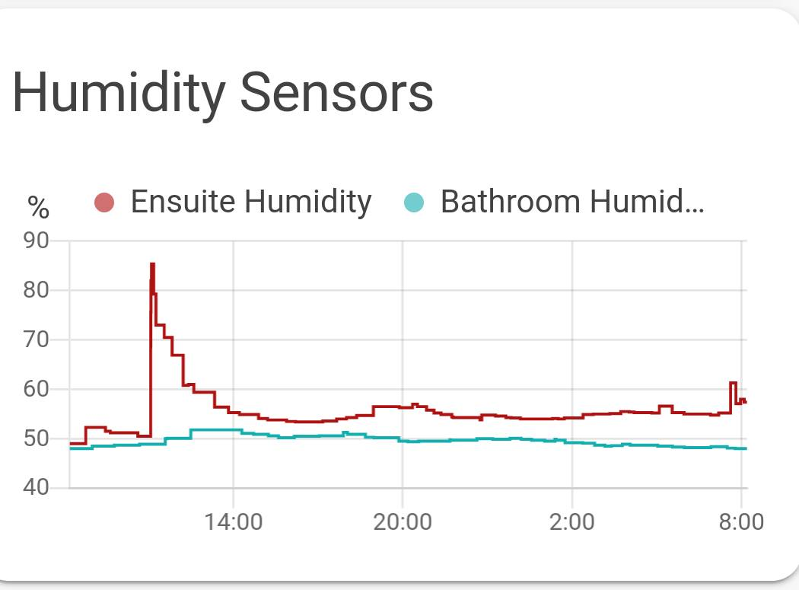
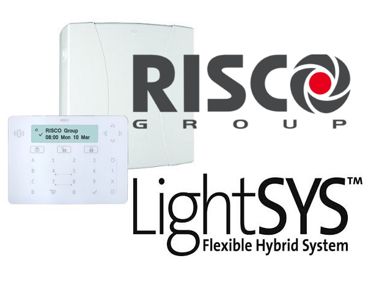
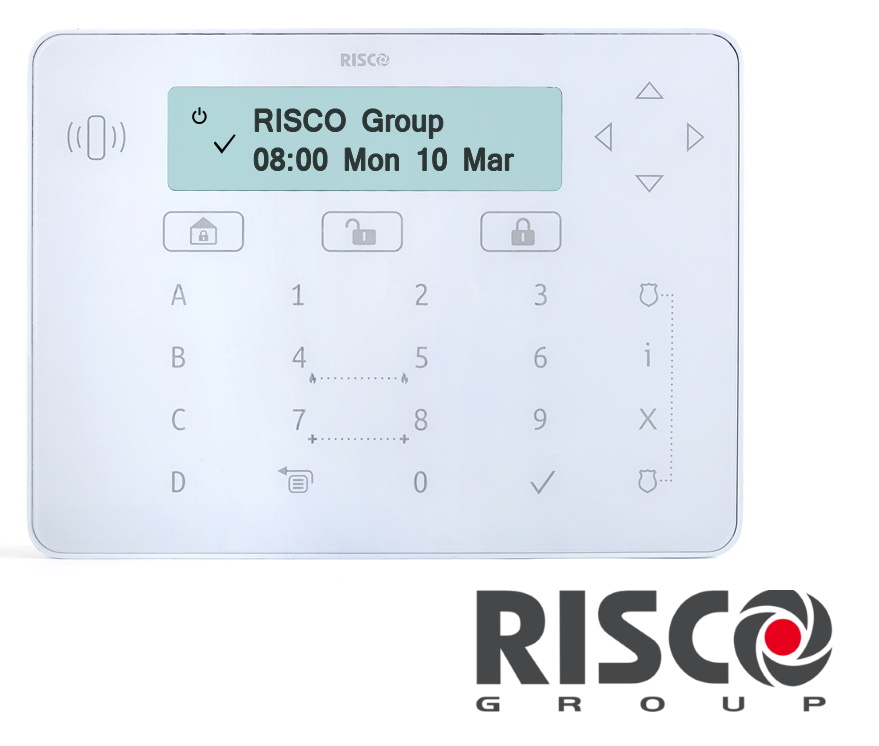
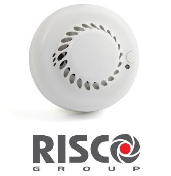
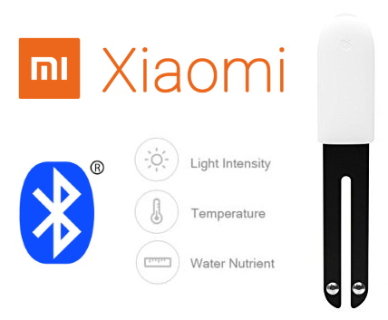
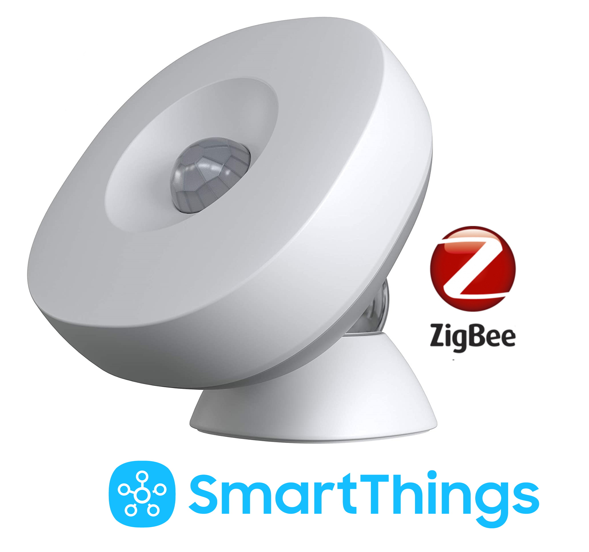
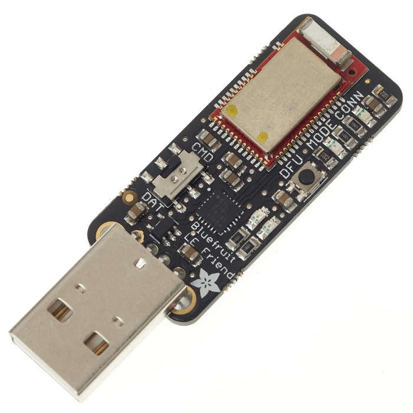
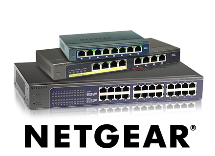

# **Dr John's Home Assistant Configuration**
  
Home Assistant has made numerous improvements to the way we live, making our lives easier in many ways.  This repo is dedicated to the hard work of those who have put their heart and soul into this community.

Below I list the components, how they are used and why.  In each section I try to highlight the key problems, the solutions and benefits gained.

**Table of Contents**
* [Climate Control](#climate-control)
    * [Remote Control Windows & Blinds](#remote-control-windows--blinds)
    * [Central Heating & Hot Water](#central-heating--hot-water)
* [Audio / Visual](#audio--visual)
    * [Lounge Audio / Visual](#lounge-audio--visual)
    * [Multiroom Audio](#multiroom-audio)
    * [Live TV and Streaming Services](#live-tv-and-streaming-services)
* [Home Automation Components](#Home-Automation-Components)
    * [Home Assistant Hardware](#Home-Assistant-Hardware)
    * [Home Assistant Software](#Home-Assistant-software)
    * [Voice Interaction](#Voice-Interaction)
    * [Humidity Controlled Fans](#Humidity-Controlled-Fans)
    * [Lighting](#Lighting)
    * [Security with Flowers](#Security-with-Flowers)
    * [Presence Detection & Future Ambitions](#presence-detection--future-ambitions)
    * [Network Infrastructure](#Network-Infrastructure)
    * [Lovelace UI Screenshots](./LovelaceUI.md)
* [Acknowledgements](#Acknowledgements)

# Climate Control

## Remote Control Windows & Blinds
| Velux Windows | Velux Blinds | Velux Active CO2 Sensor | Velux Active Gateway |   
| --- | --- | --- | --- |
|  |  |   |  |

When I extended the apartment some years ago, I had five [Velux Integra](https://www.velux.co.uk/products/roof-windows/integra) roof windows installed, each with their own blackout blind.  Although Velux provide a remote control device, they use the [IO-Homecontrol](http://www.io-homecontrol.com/) protocol for which there is no direct interface.  After doing much research, I found an integration root: [Velux Active](https://www.velux.co.uk/products/smart-home/velux-active) works with [Apple HomeKit](https://www.home-assistant.io/integrations/homekit/) which is a [zeroconf Home Assistant](https://www.home-assistant.io/integrations/zeroconf/) integration!  Now all five windows and five blinds can be controlled by Home Assistant along with the  [Velux Active](https://www.velux.co.uk/products/smart-home/velux-active) temperature / CO2 sensors.

Note that [Velux Active](https://www.velux.co.uk/products/smart-home/velux-active) is touted as indoor climate control system which will keep your home fresh by period ventilation.  This marketing speak equates to the system opening and closing your windows at random throughout the day, regardless of the outdoor temperature.  Very unwelcome in the winter!  The first thing I did was switch off all automations in the Velux app and implemented proper automations in Home Assistant.

One benefit of [Velux Active](https://www.velux.co.uk/products/smart-home/velux-active) is that it comes with a CO2 sensor which also operates as a remote control for the windows in the same room.  I now have an automation which opens the kitchen window when the CO2 level reaches over 1250ppm or if either gets too hot, both of which often occur during cooking.  Screenshots of my *kitchen view* can be seen here: [Lovelace UI Screenshots](./LovelaceUI.md)

### Central Heating & Hot Water
| Drayton Wiser Multiroom Kit 2 | Drayton Wiser TRVs | Drayton Wiser Roomstat | Heating & Hot Water |
| --- | --- | --- | --- | 
|  |  |  |  |

Like most homes the heating was either all or nothing. That is, once the boiler is on, then all the radiators get hot regardless.  Obviously thermostatic radiator valves can reduce the temperature in certain rooms, but that does not cater for the following scenarios: 
<ul>
<li>When working from home, I want to switch off all the radiators in the rest of the home.</li>
<li>When my partner is home alone, only the bedroom needs heating, so switch off all the radiators in the rest of the home</li>
<li>When the family is about, I want the whole home heated</li>
</ul>

I found that I was constantly walking around the flat turning the radiator valves on and off manually.  Clearly I needed remote controlled thermostatic values on each radiator which would allow me to set the temperature of each room individually.

I posted my requirements on the [community forum](https://community.home-assistant.io/t/167409/) so others could make suggestions.  Then I fortunately came across the excellent [Drayton Wiser Heat Hub integration for Home Assistant](https://github.com/asantaga/wiserHomeAssistantPlatform) by [@Angelo_Santagata](https://github.com/asantaga/) and team is available on HACS as the *Wiser Heating Component for Home Assistant*

I now have room by room heating control which adapts to where we are and what we are doing.  Screenshots of my *heating control* can be seen here: [Lovelace UI Screenshots](./LovelaceUI.md)

Every country has their own way of describing central heating systems and how they operate.  In the UK, we rarely have integrated heating and cooling systems (HAVC), whereas these are commonplace in other countries with more extreme climates.  For clarity, I include the final image above shows the pipework that underpins a typical British central heating & hot water system.  As there are two valves controlling two sets of pipework, this is call by plumbers a *2-channel system*.  

# Audio / Visual
Years ago, I was a serious Hi-Fi buff, and this reflects in my choice of audio components found around the apartment.  Originally, I had a Logitech Squeezebox Touch in every room streaming music from a central Logitech Music Server (LMS).  Unfortunately, these units were discontinued by Logitech years ago and with the advent of high-quality streaming services such as [Tidal](https://tidal.com/), I was in dire need of a technology refresh. So I purchased a couple of [Google Chromecast Audio](https://www.google.com/chromecast/built-in/audio/) devices and was amazed to find just how good they were!  Firstly, they have a *full dynamic range* mode so that they can drive my stereo system to an acceptable level.  Also, to my surprise they have a *group* mode so that the same music can be streamed to several rooms (i.e. multiroom).  After a few months of running both systems in parallel I found I hardly used Logitech system anymore as streaming  [Tidal](https://tidal.com/) to [Chromecast Audio](https://www.google.com/chromecast/built-in/audio/) was so, so convenient.  So, the Logitech units were sold and my use of [Plex](https://www.plex.tv/)  expanded to encompass my own music collection.  I always had a love/hate relationship with the Logitech Music Server (LMS), so I was very glad to see it go!
 
## Lounge Audio / Visual
| EPOS M16i Speakers | Audiolab CDQ / Amp | Chromecast Audio | Logitech Harmony Hub | 
| --- | --- | --- | --- |
|  |  |  |  |  

| Samsung Smart TV | Google Chromecast | Humax Freesat PVR | Samsung Blu-ray Player |
| --- | --- | --- | --- |
|  |  |  |   |  

My lounge AV is built around my aging stereo system.  Fortunately, the [Audiolab](https://www.audiolab.co.uk/) CDQ has multiple digital inputs which allow it to be my *AV receiver*.  Although the [Audiolab](https://www.audiolab.co.uk/) units do have a IR remote control they only have a manual power button.  The [Logitech Harmony Hub Companion](https://www.logitech.com/en-gb/product/harmony-hub) was a godsend, but it only solved some of the problems.  Obviously, it did not power on the [Audiolab](https://www.audiolab.co.uk/) units, but worse did not change the TV input correctly when changing source.  This is particularly annoying as the Harmony Hub does know how to send a IR command to select a particular input on the TV, but does not allow you to select it in their app.

Home Assistant automations allowed me to solve all the outstanding issues with the Harmony Hub.  I set up automations for each state change event that needed an input change.  For example, when changing from watching a Blu-ray disk to watching the Freesat PVR needs a different HDMI port to be selected. An automation would detect the change and have the Harmony Hub send the correct IR sequence.  Some automations required a delay while the peripheral warmed up.  For example, the TV takes approximately 10 seconds to switch on, so I had to delay the HDMI port change request until it was ready.  This I did by simply sending the same request multiple times, after a few second delay. 

The final problem of the manual switches on the [Audiolab](https://www.audiolab.co.uk/) equipment was solved by a Smart Plug.  I simply leave the [Audiolab](https://www.audiolab.co.uk/) equipment switched on and have the Smart Plug turn on the power when requested by a Harmony Hub state change.  

The result is that a collection of new and aging equipment works together flawlessly.

## Multiroom Audio
| Q Acoustic Speakers | Pro-Ject Audio Amp | Google Chromecast Audio | Logitech Harmony Hub |
| --- | --- | --- | --- |
|  |  |  |   |  

In addition to the lounge, all other rooms have a set-up built around the diminutive [Pro-Ject Audio Stereo Box S2](https://www.project-audio.com/en/product/stereo-box-s2/) amplifier, a pair of [Q Acoustic 2020i](https://www.qacoustics.co.uk/q-acoustics-2020i-bookshelf-speakers-pair.html) speakers and a [Google Chromecast Audio](https://www.google.com/chromecast/built-in/audio/).  Each room has a [Logitech Harmony Hub](https://www.logitech.com/en-gb/product/harmony-hub) which allow me (via Home Assistant) to control the multiroom audio throughout the home.  So, guests can stream their own music to the room they are in, or I can stream the same music to every room.  All very convenient!

The master bedroom has the above setup plus another [Samsung Smart TV](https://www.samsung.com/uk/tvs/smart-tv/highlights/) and [Google Chromecast](https://store.google.com/gb/product/chromecast) device for video streaming.  The guest room simply has a [LG TV](https://www.lg.com/uk/tvs) with a [Google Chromecast](https://store.google.com/gb/product/chromecast).  Screenshots of how my Harmony Hubs appear can be seen here: [Lovelace UI Screenshots](./LovelaceUI.md)

## Live TV and Streaming Services
Like most people, I have far too much choice when it comes to programming.  [Netflix](https://www.netflix.com/) is my video streaming service of choice.  [Amazon Prime Video](https://www.primevideo.com/) annoys me because every movie I  want to watch is an additional charge.  I would really like them to add a *Show included content only* option, but obviously that will never happen! 
 
Beside the modest 300+ movies on my own [Plex media server](https://www.plex.tv/), I have friends with massive libraries of content.  At the last count they have another 2,000 or so movies and 250 TV series.  My [Humax Freesat PVR](https://uk.humaxdigital.com/product/hdr-1100s/) has hundreds of live TV channels, of which I only watch the BBC. Basically, there are not enough hours in my life to watch all that content!

[Tidal](https://tidal.com/) is my music streaming service of choice as it provides high quality audio content with great ease of use. Years ago, I used Spotify, but they made the rash decision to stop supporting Logitech Media Server (which I had at the time), so I could no longer play music in multiple rooms.  At the time, [Tidal](https://tidal.com/) lacked some of the features of Spotify, but they soon caught up.  I now have a family subscription, so all five family members can enjoy high quality streaming services. 

I only ever use the [HD HomeRun](https://www.silicondust.com/) to watch Live TV on my desktop PC when I am working from home and there is some specific political event going on.  I did try the integration with [Plex TV](https://www.plex.tv/en-gb/tv/), but I don't see the point as I have a perfectly good [Humax Freesat PVR](https://uk.humaxdigital.com/product/hdr-1100s/) which records a better quality picture and is far more convenient to use.

# Home Automation Components

## Home Assistant Hardware

| Raspberry Pi 4 Model B 4GB | Raspberry Pi 4 Enclosure | Conbee II Zigbee Gateway | SanDisk Extreme 64GB MicroSD | 
| --- | --- | --- | --- |
|  |  |  |  | 

There is nothing remarkable about my Home Assistant hardware. So far I have not seen any performance problems, but that is possibly because I don't have any high demand applications like video cameras and I don't record as much device history data as others.

With regard to the Zigbee gateway, I did initally try the Elelabs Zigbee Raspberry Pi Shield, but after some 40 hours (yes 40 hours!!!) of screwing around with docker configs, building and rebuilding my machine, I just could not get it to work.  In contrast, the [Conbee II Zigbee Gateway](https://phoscon.de/en/conbee2) was up and running in 30 minutes.  

I have heard that others have problems with failing MicroSD cards and have therefore switched over to solid state drives.  Due to my [backup routine](./config#backup-routine), I am not too worried if it does fail as I have a replica MicroSD card onto which I can restore my last snapshot.  Obviously if does fail, I will be in the market for a new solid state drive.  Hopefully SSD will be bootable option on the Raspberry Pi 4 by then!

I did notice that my Pi was running rather hot, so I purchased a new [enclosure with integrated fan](https://www.ebay.co.uk/sch/m.html?_odkw=&_ssn=john_sinclair203&_armrs=1&_osacat=0&_from=R40&_trksid=m570.l1313&_nkw=pi+4&_sacat=0).  Now my CPU now averages 40&#8451; rather than 80&#8451;. 

## Home Assistant Software
| Home Assistant Core | Docker | Nabu Casa | MQTT Server |
| --- | --- | --- | --- |
|  |  |  |  |

I run [Home Assistant Core in Docker containers](https://www.home-assistant.io/docs/installation/docker/) installed on [Raspbian Buster](https://www.raspberrypi.org/blog/buster-the-new-version-of-raspbian/) with all my add-ons and integrations also running in Docker containers.  I use deConz for the devices exposed by the [Conbee II Zigbee gateway](https://phoscon.de/en/conbee2).  So far, I only use the Mosoquitto broker for integration with my [Security Alarm outlined below](#Security-with-Flowers).

## Voice Interaction
| Google Nest Mini | Google Assistant | Google Pixel Phone | Plex Assistant |
| --- | --- | --- | --- |
|  |  |  |  | 

Having had Android phones for many years, Google Assistant seemed the natural choice for voice interaction with Home Assistant.  Fortunately, I discovered Google provides various celebrity voices, so I now listen to the soothing voice of singer John Legend.

 My only bug bear is that [Google Home](https://store.google.com/gb/product/google_home) does not support [Tidal](https://tidal.com/) as a native music provider whereas they do support Spotify, Deezer and their own subscription services YouTube & Google Play Music.  So, I cannot simply ask Google Assistant to play something for me from Tidal's vast catalogue.  To solve this problem, I am working with [Ryan Meek](https://github.com/maykar) to expand the [Plex Assistant](https://github.com/maykar/plex_assistant) to encompass music as well as movies.

## Humidity Controlled Fans
| Bathroom Switch | Ensuite Switch | Humidity Sensors | Humidity Graph | 
| --- | --- | --- | --- |
|  |  |  |  |

The fan used go on and off with the light switch. This was particularly annoying as the fan is noisy, especially at night. Often, we would disable the fan with the tri-pole switch, but this meant people had to proactively remember to flick on the switch before having a shower - which they never did! Also, after having a shower, the fan goes off with the light switch, thus leaving behind a steamy bathroom.

Now Home Assistant switches on the bathroom fan when the humidity goes over 75% and off again when it drops below this point. The result is that the fan only comes on when it is needed. No more, no less. No more noisy fans or steamy bathrooms!

Above I provide an example humidity graph which shows just how effective the sensors are at picking up the rapid change.  So far, the automation works well, particularly as UK does not suffer from high humidity levels.  If the automation starts to fail, I will change it to recognise the rapid change in humidity compared to other rooms.  Until then, this will suffice.

## Lighting
| LED Strip Light Controllers | SmartThings Smart Plugs | Xiaomi Aqara Wall Switch | Xiaomi Smart Button |
| --- | --- | --- | --- |
|  |  |  |  |

I upgraded to [Home Assistant](https://www.home-assistant.io/) after dabbling with [SmartThings](https://www.smartthings.com/), hence I have a collection of [SmartThings](https://www.smartthings.com/) Zigbee devices.  This also explains why I switched out the [MiLight](https://www.milight.com/) LED controllers for [GLEDOPTO](https://www.gledopto.eu/) Zigbee LED controllers.  A nonsensical thing to do with [Home Assistant](https://www.home-assistant.io/), but SmartThings did not support the [MiLight](https://www.milight.com/) platform.

By far my partner's favourite addition to the apartment is the [Xiaomi Aqara double wall switch](https://xiaomi-mi.com/sockets-and-sensors/remote-switch-for-aqara-smart-light-wall-switch-double-key/) which I have configured to performs several actions:
* Left hand switch:
    * Single click - switches the hall LED strip lights on/off (WHITE)
    * Double click - switches the hall LED strip lights on/off (RED)
    * Long press - switches on/off the central heating and the Google Mini announces the status: *The central heating has now been turned ON*
* Right hand switch:
    * Single click - switches the lounge LED strip lights on/off (WHITE)
    * Double click - switches the lounge LED strip lights on/off (RED)
    * Long press - switches on/off the hot water and the Google Mini announces the status: *The hot water has now been turned ON*

A [Xiaomi Smart Button](https://xiaomi-mi.com/sockets-and-sensors/xiaomi-mi-wireless-switch/) in the guest room allows my guests to switch on the heating in their room.  As [outlined above](#central-heating--hot-water), the heating is controllable on a room by room basis, so this was easy to implement with an automation.

## Security with Flowers
| Risco Security Alarm | Risco Elegance Panel | Smoke & Heat Detector | Xiaomi Mi Flora | 
| --- | --- | --- | --- |
|  |   |  |  |

My apartment was already prefitted with cables to fit a security alarm when I moved in.  At the time I found it hard to find a system that had a mobile phone app and was wired.  All of the consumer products were wireless, which to be honest, I don't trust and made the prefitted cables redundant.  Wired security alarms are the domain of professional fitters who sell equipment with which they are familiar but typically such systems are primative and do not have mobile phone apps. The LightSys 2 from Risco seemed the most flexible choise and I eventually managed to find a tame fitter to install everything.  The Risco system was about the only one that did not have a cheap plastic control panel.  Their Elegance panel is just that: elegant.  The panel also has a proximity detector, so we all have keyfobs to set/unset the alarm.  The smoke and heat detectors are also wired into the security alarm, so everything is integrated.

When I started dabbling with Home Assistant, I thought that integration of the Risco security alarm would be hard to achieve, but Luca Calcaterra has done an excellent job with his [Risco MQTT bridge](https://github.com/lucacalcaterra/risco-mqtt-bridge).  Even better, he provides a Docker image for the [Raspberry Pi](https://github.com/lucacalcaterra/risco-mqtt-bridge#run-with-docker) so the installation could not be easier.  It is a shame that the alarm's PIRs cannot be used as presense detectors by HA, but the LightSys does not update the status of the detectors unless the alarm is set; which would of course set off the alarm!  Screenshots of my Risco Alarm panel can be seen here: [Lovelace UI Screenshots](./LovelaceUI.md)

I purchased a Xiaomi Mi Flora sensor more out of interest than for any horticultural ambition. The integration with HA is straight forward, but the device does take some time to provide enough status updates for it to register.  Until that point, the device is marked as unavailable in the Lovelace UI.  This gave me the impression that the sensor was not working and I spent 30 minutes screwing with my Bluetooth settings when in fact everything was fine.  I cannot say it is the most useful addition to my home automation, especially because the plant it monitoring is one of the hardest to kill: a cactus!

## Presence Detection & Future Ambitions
| Life360 Phone App | SmartThings Motion Sensor | Adafruit Bluetooth LE Sniffer | Huna Bluetooth LE Blinds |
| --- | --- | --- | --- | 
|  |  |  |  |

Like most, I struggle with presense detection. My, so far limited GeoFencing automations, rely on the excellent [Life360 phone app](https://www.life360.com/).  Of course once somebody arrives home, they are detected by the [SmartThings Motion Sensor](https://www.smartthings.com/uk/products/smartthings-motion-sensor).

[Somfy](https://www.somfy.co.uk/) make some dreadful technology decisions in the home automation space, inventing and dropping *standards* like an irrational fever.  They should be ashamed of the terrible [Somfy Tahoma home automation hub](https://www.poweredblinds.co.uk/somfy-tahoma/) which I reviewed on [Amazon and on my wiki here](https://github.com/DrJohnT/HomeAssistantPublicConfig/wiki/Somfy-Tohoma-Review).

Before I got into Home Assistant, I made the mistake of purchasing three Somfy Huna battery operated Bluetooth blinds which can be controlled by wall switches and a phone app.  The problem is that there is no way to integrate them into Home Assistant without reverse engineering the Bluetooth LE protocol.  To this end, I purchased an [Adafruit Bluetooth LE Sniffer](https://www.adafruit.com/product/2269), installed [Wireshark](https://www.wireshark.org/) on my Raspberry Pi and [Nordic Semiconductor nRF Connect](https://www.nordicsemi.com/Software-and-tools/Development-Tools/nRF-Connect-for-mobile) on my phone.  However, the task is not easy, so to date I have failed to find the magic BLE endpoint that controls everything.  

My other ambition, as [outlined above](#Voice-Interaction), is to integrate [Tidal](https://tidal.com/) using [Plex Assistant](https://github.com/maykar/plex_assistant).

## Network Infrastructure
| Netgear ReadyNAS | Netgear Wireless AP | Netgear Switches | Virgin Hub 3.0 | 
| --- | --- | --- | --- | 
|  |   |  |   |

I had Cat6 cabling installed throughout the apartment when I had it renovated and extended.  The network cupboard nestles under the eaves of the building and contains a 16-port [Netgear Ethernet switch](https://www.netgear.com/home/products/networking/switches/), the [Velux Active](https://www.velux.co.uk/products/smart-home/velux-active) gateway and the unused [HD HomeRun](https://www.silicondust.com/) and the [Netgear ReadyNAS](https://www.netgear.com/home/products/connected-storage/RN212.aspx) which runs [Plex media server](https://www.plex.tv/). Fortunately, I had the foresight to have both standard telephone cable and three coaxial cables run into the network cupboard from the outside.  This proved very useful when I switched broadband providers as it gave me the option to use [Virgin Media](https://www.virginmedia.com/) cable modem service.  The Virgin Hub 3.0 is not the best, but it is provided free of charge and gave me the chance to repurpose my Netgear router as a wireless access point for the kitchen.

I don't tend to leave my NAS on all the time, so I devised a mechanism to start up and shutdown the ReadyNAS at anytime using Home Assistant which I wrote up here: [Netgear ReadyNAS start up & shutdown](https://github.com/DrJohnT/HomeAssistantPublicConfig/wiki/Netgear-ReadyNAS-start-up-&-shutdown)

## Lovelace UI
Screenshots of my Lovelace UI can be seen here: [Lovelace UI Screenshots](./LovelaceUI.md)

## Acknowledgements
This repo is inspired by the excellent work of others listed on the [Awesome Home Assistant](https://www.awesome-ha.com/) page, especially [James McCarthy of Kingia Castle](https://github.com/JamesMcCarthy79/Home-Assistant-Config).

### Trademark Legal Notice

This repo is not created, developed, affiliated, supported, maintained or endorsed by Home Assistant. All product names, logos, brands, trademarks and registered trademarks are property of their respective owners.  All company, product, and service names used in this repo are for identification purposes only. Use of these names, logos, trademarks, and brands does not imply endorsement.
